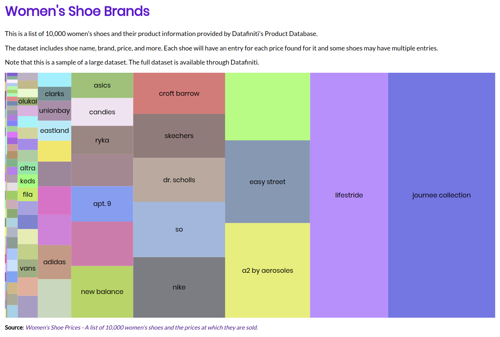

# Women shoes brands - Treemap
Simple Data Visualization (Treemap) in D3.js.
Inspired by [Masaki Yamabe's code](http://bl.ocks.org/masakick/04ad1502068302abbbcb).

Using:
* D3.js (v3)
* Random colors
* ECMAScript 6
* Women's Shoe Prices - A list of 10,000 women's shoes and the prices at which they are sold. ([Available in Kaggle](https://www.kaggle.com/datafiniti/womens-shoes-prices)). I performed a treatment on the data.

See online:
https://marialuisacp.github.io/proportions-treemap-brand-women-shoes/

